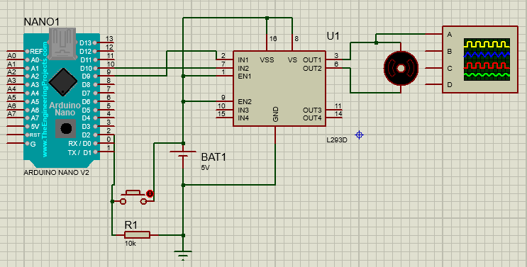

### Introdução ao PWM

PWM é uma sigla proveniente do inglês que significa Modulação por Largura de Pulso, sendo um recurso amplamente usado para controles finos de atuadores - mecanismos que realizam algum tipo de movimentação controlada por mecânica hidráulica, pneumática, entre outros.

### Componentes necessários

Os componentes para o projeto são:

- Arduino Nano
- Resistor
- Botão
- Motor
- Driver L293D

### Esquemático

<h4>Imagem 1 - Esquemático criado com o software Proteus</h4>

### Código-fonte

    #include <Arduino.h>

    int ativacao_motor = 0;

    void setup() {
    pinMode(9, OUTPUT);
    pinMode(2, INPUT);
    }

    void loop() {  // Loop principal

        // AnalogWrite controla portas analógicas, que usam o PWM para controlar sinais
        // Enquanto portas digitais tem dois estados (0% e 100%), portas analógicas
        // permitem o controle do fluxo da corrente. Exemplo: é possível aplicar 30% do total
        // da corrente na porta analógica.

        // O comando analogWrite permite o controle da porta analógica, com valores que variam de 0 a 255 (total)

        // Se o botão for pressionado
        if( digitalRead(2) == "HIGH" ) {
            
            // Se a ativação for menor que 192
            if (ativacao_motor < 192) {   
            ativacao_motor += 64;
            // Se a ativação for maior que 192 e menor que 255
            } else if (ativacao_motor < 255){
            ativacao_motor += 63;
            } else {

            // Se for igual a 255, a ativação é resetada
            ativacao_motor = 0;
            }
        }

        analogWrite(9, ativacao_motor);
        delay(250);
    }

### Funcionamento do projeto

O projeto envolve um motor que funciona com ativação pwm controlada pelo botão. Cada vez que o botão é pressionado, o percentual de ativação do motor é aumentada em 25%, retornando para a ativação inicial após ser pressionado quando estiver com 100% de ativação.

Ao ser pressionado, o botão envia um sinal ao arduino, que realizará as comparações definidas na programação do código em C++ com o objetivo de executar o processo descrito anteriormente.

